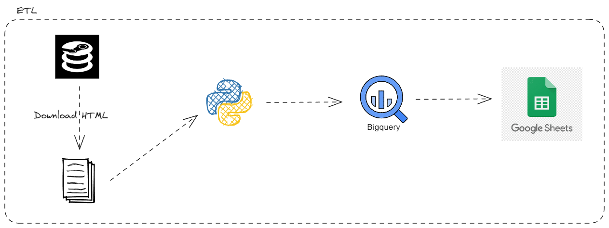

# Desafio de Engenheiro de Dados Jr. - beAnalytic

Este repositório contém minha solução para o desafio proposto pela beAnalytic para a posição de Engenheiro de Dados Jr.

## Descrição do Desafio

O desafio consistiu em:

1. Extrair informações da base de dados listada no website [SteamDB](https://steamdb.info/sales/)
2. Armazenar estes dados no Google BigQuery
3. Exportar ou conectar esses dados em um Google Sheets

## Minha Solução

Dado que a página do SteamDB não permite a extração de dados via webscraping, optei por realizar o download manual do HTML da página, coloquei no arquivo `request.txt`. Após isso, tratei o HTML para gerar as informações necessárias.

Com os dados devidamente tratados e estruturados, desenvolvi um código que transfere o resultado desse processamento (um dicionário Python) para uma tabela no Google BigQuery. Em seguida, fiz a integração dessa tabela com o Google Sheets.

Aqui está o [link](https://docs.google.com/spreadsheets/d/1yvmkhXEPdnjMMDFoqKl6zo4wa-3uY7sSfsixKt3d6B4/edit#gid=275292057) para o Google Sheets com os dados tratados e estruturados.

## Arquitetura do Projeto

A arquitetura do projeto é a seguinte:

  

## Melhorias Futuras

Uma possível melhoria para este projeto seria a automação do processo de transferência dos dados do arquivo TXT para o Google BigQuery. Isso poderia ser realizado configurando uma Cloud Function para acionar sempre que houvesse uma alteração no arquivo TXT.

Dessa forma, sempre que novos dados fossem adicionados ao arquivo TXT, eles seriam automaticamente carregados no Google BigQuery, e a tabela do Google Sheets seria atualizada em tempo real.

